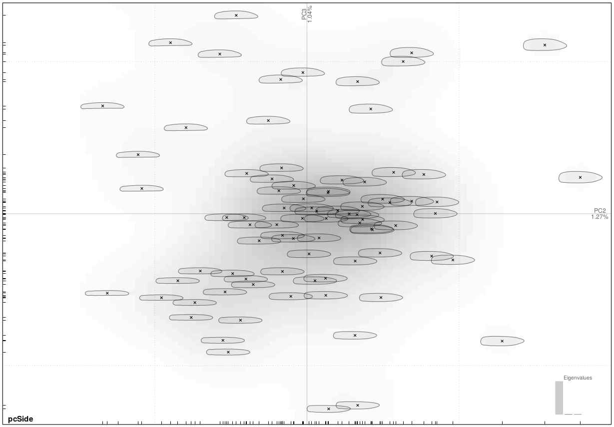
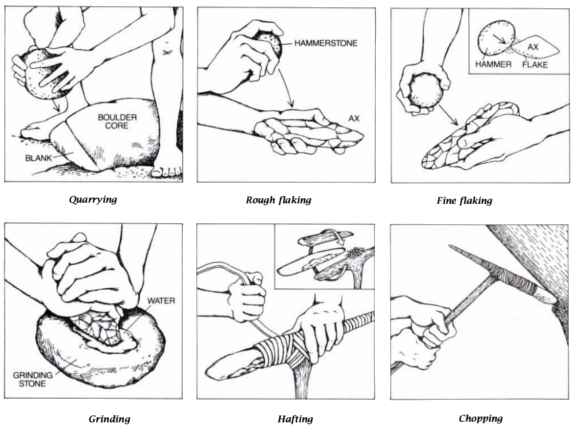
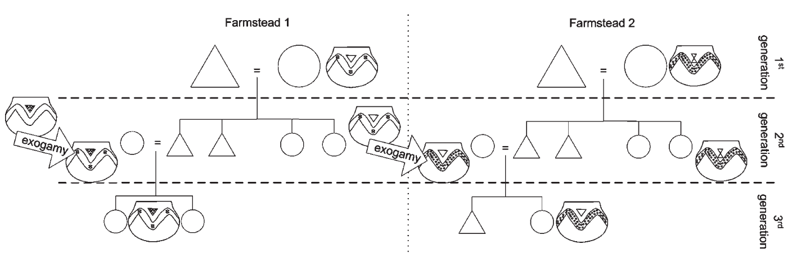

```{r, include=FALSE}
knitr::opts_chunk$set(echo = FALSE,
                      warning = FALSE,
                      tidy = FALSE,
                      message = FALSE,
                      fig.align = 'center',
                      out.width = "100%")
options(knitr.table.format = "html") 
```

# Introduction

There is some variation in the shape and size of polished stone tools (axes, adzes etc.)
In archaeology, we use this variation to construct **types**, usually with
ascribed chronological significance. Here we will explore the *origin* of this variation.

```{r img-pca, fig.cap="Variation in shape of LBK adzes, side view"}

```

# Problem 

The **variance** in shape can occur in (*at least*) two points in time:

- During the **manufacturing process**
- During the **use** and **reparations** of the tool

Changes in shape during the **use** are limited to resharpening of the working edge of the 
tool or reparations of the part that is attached to the shaft.

The changes in shape during the use phase of the tool are thus usually minor ones but
stacked together, these might lead to larger differences.

In our point of view, the **manufacturing process** is nevertheless the main source of 
shape variation of the polished and beveled artefacts.

<br>

<br>

# Manufacture

```{r img-manuf, fig.cap="Idealized manufacture process (Toth 1992)"}

```

We have quite a good idea of the manufacturing process of polished and beveled stone 
tools thanks to *analogies* from New Guinea (e.g. Pétrequin -- Pétrequin 2011; Hampton 1999; Toth 1992 etc.)
and documented quarries (e.g. Prostředník -- Šída et al. 2005; Pétrequin -- Pétrequin 1998).

## A complicated process?

1. Quarrying a stone block
2. Rough flaking into an amorphous roughout
3. Fine flaking into a blank resembling the ideal final product in shape and size
4. Grinding the working edges or the whole surface
5. Fine polishing...

The process *needs to be **learned!***

## The case of LBK pottery

```{r img-pots, fig.cap="Simplified model of pottery traditions in the LBK (Claßen 2009)"}

```

> Premise: *Women* making pottery.

**Idea of change** in pottery *style* happening due to:

- exogamy (changing place of residence): 
  women from one *pottery tradition* comes to a region with a *different tradition*
- *learning*: 
  the *newcomer* adopts the local *main motif* of decoration learned from *local women*
- *change*: 
  happens in form of adding *secondary motifs* of decoration that the *newcomer* brings from *her* home community

### Implications of the model

- Change happens only at a **certain moment of time**: 
  when the *newcomer* comes into the community and is combining the *local* and *foreign* *motifs*
- No space for individual **invention** and **agency**.

<br>

<br>

# Model

> Premise: *Men* making polished stone tools.

If we apply the same model on the polished and beveled stone tools:

Men are mostly *local* (e.g. Bentley 2012)  
  &rarr; no *foreign* input &rarr; no **change** in case of polished tools?

### Therefore...

- There are not *large* changes in shape variation of axes and adzes.
- There is a shared idea of both the:
  - **shared manufacturing practice** and
  - **ideal shape** the final artefact will take.
- Both of these are *learned*...

- The variation originates from **small decisions** taken during the process of 
manufacture.

# Conclusion

The **decisions** leading to **variability in shape and size** of polished and beveled stone tools 
are **initially small and insignificant** caused by personal preference,
skill, technological necessity or a combination of these and cumulatively result in a 
**larger and significant outcome** (inspired by [the tyranny of small decisions](https://en.wikipedia.org/wiki/Tyranny_of_small_decisions)).

<br>

<br>

# References

Bentley, R. A., Bickle, P., Fibiger, L. et al. 2012. Community differentiantion and kinship among Europe's first farmers *PNAS* 109, 9326-9330.

Claßen, E. 2009: Settlement history, land use and social networks of early Neolithic communities in western Germany. 
In Creating Communities: *New Advances in Central European Neolithic Research*, eds. D. Hofmann, P. Bickle, 95-110. Oxford: Oxbow Books.

Hampton, O. W. Bud 1999: *Culture of Stone. Sacred and Profane Uses of Stone among the Dani.* 
College Station: Texas A&M University Press.

Pétrequin, P., Pétrequin A. M. et al. 1998. From the Raw Material to the Neolithic Stone Axe. Production Processes and Social Context. In *Understanding the Neolithic of North-Western Europe*, eds. M. Edmonds, C. Richards, 277-311. Glasgow: Cruithne Press.

Pétrequin, P., Pétrequin, A. M. 2011: The twentieth-century polished stone axeheads
of New Guinea: why study them? In *Stone Axe Studies III*, eds. V. Davis, M. Edmonds, 333-349. Oxford: Oxbow Books.

Prostředník, J., Šída, P., Šrein, V., et al. 2005: Neolithic quarrying in the foothills of
the Jizera Mountains and the dating thereof. *Archeologické rozhledy* LVII, 477 – 492.

Toth, N., Clark, D., Ligabue, G. 1992: The Last Stone Ax Makers. *Scientific American* 267/1, 88-93.
